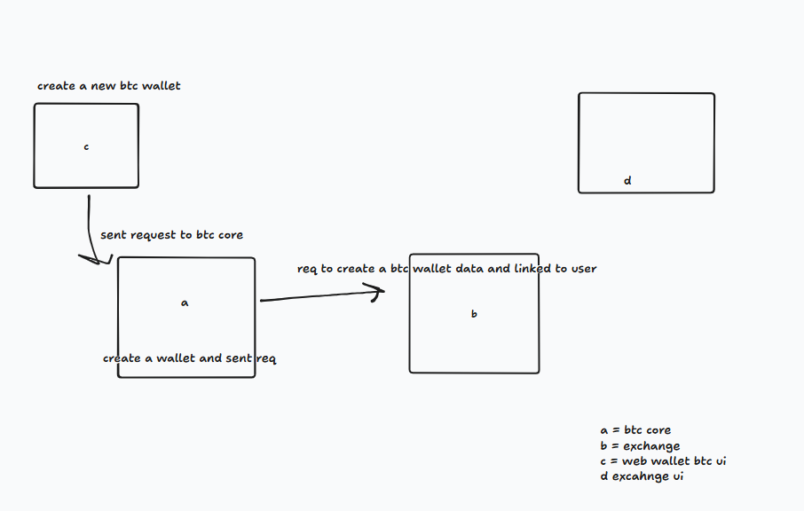

use docker to start project
step

1. sudo docker build -t trading .
2. sudo docker run -p 3000:3000 trading
3. ready to start

# Elysia with Bun runtime



## Getting Started

To get started with this template, simply paste this command into your terminal:

```bash
bun create elysia ./elysia-example
```

## Development

To start the development server run:

```bash
bun run dev
```

Open http://localhost:3000/ with your browser to see the result.
